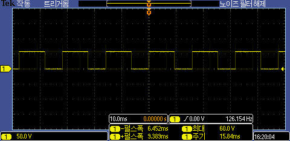
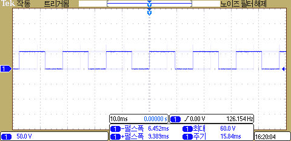

# snu.emtse
"전자학 및 계측론" 실험보고서 작성에 사용한 도구 모음: matplotlib @ jupyter, circutikz

- 회로 소자 그림: circuitikz로 그린 회로들.
- 그래프 그리기: matplotlib 사용. jupyter에서 `%matplotlib inline`을 쓰면 훨씬 편해진다.

- 오실로스코프 이미지 반전시키기:
  - 검은 배경의 이미지는 출력할 때 토너도 낭비되고 가독성도 떨어진다. 반전시키자.
  - `source` 폴더에 반전시킬 이미지들을 넣고 `python negative.py` 실행.
    - Pillow 패키지가 없을 경우 `pip install Pillow`
  - 
  - 

---

- 1~7주차 회로 그림: `0n주차-**` 폴더 내부.
  - `latexmk -pdf && latexmk -c` 명령을 통해 한 폴더 내의 텍 파일들을 한번에 조판할 수 있습니다.
- 데이터 plot: `plots`  폴더 내부.

## 용례

- [1주차 보고서](https://cdn.jsdelivr.net/gh/seungwonpark/snu.emtse/LM1_Team01.pdf)

